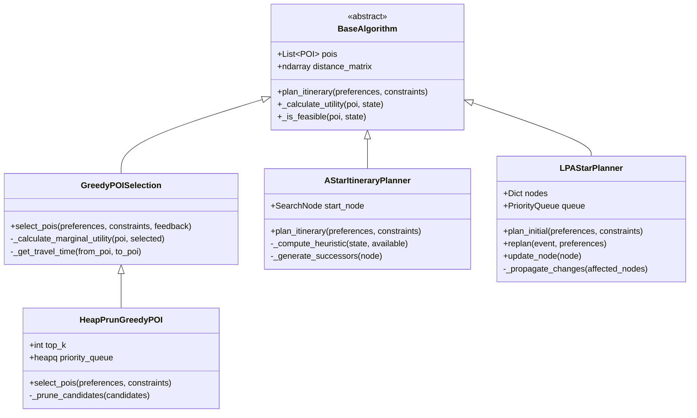
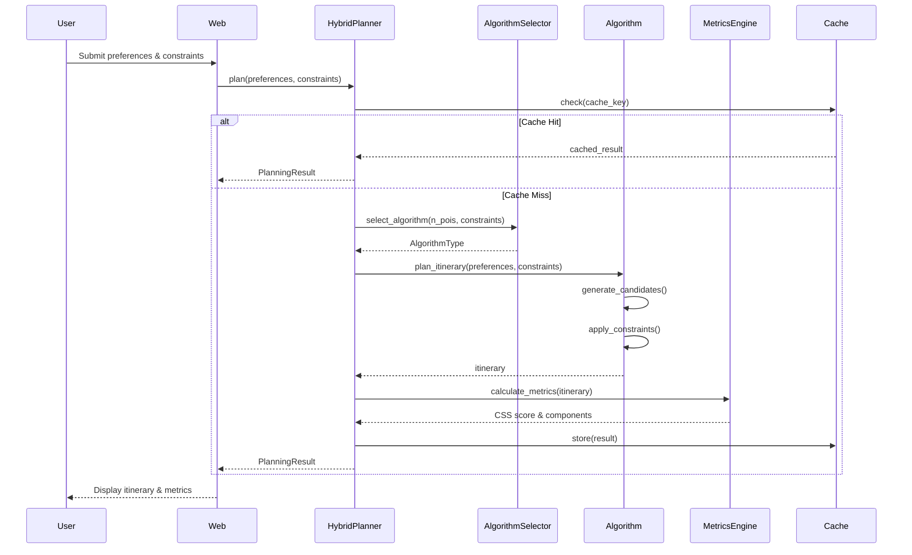
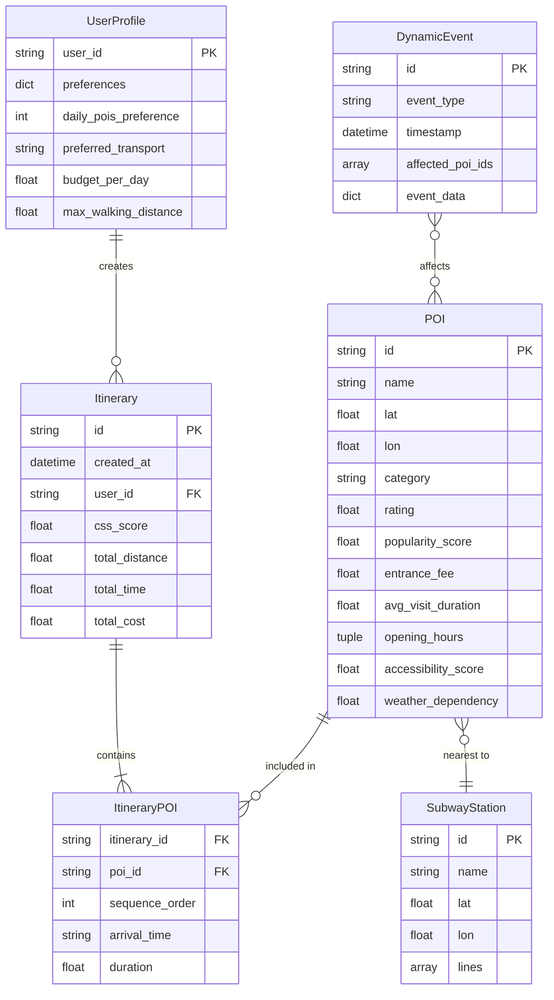
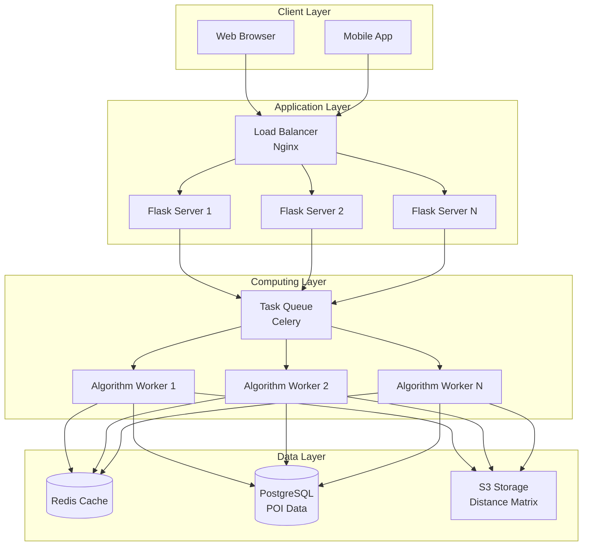
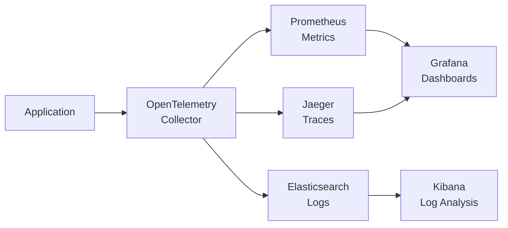

# System Architecture - NYC Itinerary Ranking

## Overview

This document describes the system architecture for the NYC Itinerary Ranking system developed as part of the Bachelor's thesis "Ranking Itineraries: Dynamic Algorithms Meet User Preferences" at NKUA.

## High-Level Architecture

```mermaid
graph TB
    subgraph "User Interface Layer"
        Web[Web Interface<br/>Flask + Leaflet.js]
        CLI[Command Line<br/>Interface]
        API[REST API]
    end
    
    subgraph "Algorithm Layer"
        HP[Hybrid Planner<br/>Orchestrator]
        GR[Greedy O&#40;n²&#41;<br/>Algorithm]
        AS[A* Search<br/>Optimal]
        LPA[LPA*<br/>Dynamic]
        HG[HeapGreedy<br/>Optimized]
    end
    
    subgraph "Core Components"
        MET[Metrics Engine<br/>CSS Calculator]
        CACHE[Result Cache<br/>LRU]
        SEL[Algorithm<br/>Selector]
        FB[Feedback<br/>Processor]
    end
    
    subgraph "Data Layer"
        POI[(POI Database<br/>10,847 NYC POIs)]
        DM[(Distance Matrix<br/>Manhattan)]
        RT[(R-tree Index<br/>Spatial)]
        SUB[(Subway Data<br/>Stations)]
    end
    
    Web --> API
    CLI --> HP
    API --> HP
    
    HP --> SEL
    SEL --> GR
    SEL --> AS
    SEL --> LPA
    SEL --> HG
    
    HP --> CACHE
    HP --> MET
    HP --> FB
    
    GR --> MET
    AS --> MET
    LPA --> MET
    HG --> MET
    
    MET --> POI
    MET --> DM
    
    GR --> RT
    AS --> RT
    LPA --> RT
    HG --> RT
```



## Component Details

### 1. Algorithm Components

#### Class Diagram - Algorithm Hierarchy



#### Sequence Diagram - Planning Flow



### 2. Data Model

#### Entity Relationship Diagram



### 3. API Specification

#### REST API Endpoints

```yaml
openapi: 3.0.0
info:
  title: NYC Itinerary Ranking API
  version: 1.0.0
  description: API for the Bachelor's thesis itinerary planning system

paths:
  /api/pois:
    get:
      summary: Get all POIs
      parameters:
        - name: category
          in: query
          schema:
            type: string
        - name: bounds
          in: query
          schema:
            type: object
      responses:
        200:
          description: List of POIs
          content:
            application/json:
              schema:
                type: object
                properties:
                  success: 
                    type: boolean
                  pois:
                    type: array
                    items:
                      $ref: '#/components/schemas/POI'

  /api/plan:
    post:
      summary: Generate itinerary
      requestBody:
        content:
          application/json:
            schema:
              type: object
              properties:
                algorithm:
                  type: string
                  enum: [hybrid, greedy, heap_greedy, astar, lpa_star]
                preferences:
                  type: object
                  additionalProperties:
                    type: number
                constraints:
                  $ref: '#/components/schemas/Constraints'
      responses:
        200:
          description: Generated itinerary
          content:
            application/json:
              schema:
                $ref: '#/components/schemas/PlanningResult'

  /api/update:
    post:
      summary: Dynamic update (LPA*)
      requestBody:
        content:
          application/json:
            schema:
              type: object
              properties:
                type:
                  type: string
                  enum: [subway_disruption, weather_rain, poi_closed]
                session_id:
                  type: string
      responses:
        200:
          description: Updated itinerary
          
  /api/feedback:
    post:
      summary: Submit user feedback
      requestBody:
        content:
          application/json:
            schema:
              type: object
              properties:
                rejected_pois:
                  type: array
                  items:
                    type: string
                must_include_pois:
                  type: array
                  items:
                    type: string

components:
  schemas:
    POI:
      type: object
      properties:
        id:
          type: string
        name:
          type: string
        lat:
          type: number
        lon:
          type: number
        category:
          type: string
        rating:
          type: number
        entrance_fee:
          type: number
          
    Constraints:
      type: object
      properties:
        budget:
          type: number
        max_time_hours:
          type: number
        min_pois:
          type: integer
        max_pois:
          type: integer
        transportation_mode:
          type: string
          
    PlanningResult:
      type: object
      properties:
        success:
          type: boolean
        itinerary:
          type: object
        metrics:
          type: object
        runtime:
          type: number
        algorithm_used:
          type: string
```

### 4. Algorithm Complexity Analysis

| Algorithm | Time Complexity | Space Complexity | Quality | Use Case |
|-----------|----------------|------------------|---------|----------|
| Greedy | O(n²) | O(n) | ~85% optimal | Real-time, large datasets |
| HeapGreedy | O(n log k) | O(k) | ~80% optimal | Very large datasets |
| A* | O(b^d) | O(b^d) | 100% optimal | Small problems, quality critical |
| LPA* | O(k log k) | O(n) | 100% optimal | Dynamic replanning |
| Hybrid | Varies | O(n) | ~96% optimal | General purpose |

Where:
- n = number of POIs (10,847)
- k = number of changed nodes
- b = branching factor
- d = solution depth

### 5. Performance Metrics

#### CSS (Composite Satisfaction Score) Formula

```
CSS = w₁ × SAT + w₂ × TUR + w₃ × FEA + w₄ × DIV

Where:
- SAT = Attractiveness Score (w₁ = 0.35)
- TUR = Time Utilization Rate (w₂ = 0.25)
- FEA = Feasibility Score (w₃ = 0.25)
- DIV = Diversity Score (w₄ = 0.15)
```

#### Component Calculations

```python
# Attractiveness Score
SAT = Σ(rating_i × popularity_i × preference_alignment_i) / n

# Time Utilization Rate
TUR = (Σ visit_duration_i) / total_available_time

# Feasibility Score
FEA = Π(constraint_satisfaction_i)

# Diversity Score (Vendi Score)
DIV = exp(entropy(category_distribution))
```

### 6. Database Schema

```sql
-- POI Table
CREATE TABLE pois (
    id VARCHAR(20) PRIMARY KEY,
    name VARCHAR(255) NOT NULL,
    lat DECIMAL(10, 8) NOT NULL,
    lon DECIMAL(11, 8) NOT NULL,
    category VARCHAR(50) NOT NULL,
    rating DECIMAL(2, 1),
    popularity_score DECIMAL(3, 3),
    entrance_fee DECIMAL(6, 2),
    avg_visit_duration DECIMAL(3, 1),
    opening_hour DECIMAL(4, 2),
    closing_hour DECIMAL(4, 2),
    accessibility_score DECIMAL(3, 3),
    weather_dependency DECIMAL(3, 3),
    INDEX idx_category (category),
    INDEX idx_location (lat, lon)
);

-- Distance Matrix (for fast lookups)
CREATE TABLE distance_matrix (
    from_poi_id VARCHAR(20),
    to_poi_id VARCHAR(20),
    distance_km DECIMAL(5, 2),
    PRIMARY KEY (from_poi_id, to_poi_id),
    FOREIGN KEY (from_poi_id) REFERENCES pois(id),
    FOREIGN KEY (to_poi_id) REFERENCES pois(id)
);

-- Subway Stations
CREATE TABLE subway_stations (
    id VARCHAR(20) PRIMARY KEY,
    name VARCHAR(255) NOT NULL,
    lat DECIMAL(10, 8) NOT NULL,
    lon DECIMAL(11, 8) NOT NULL,
    lines JSON
);

-- POI-Subway Proximity
CREATE TABLE poi_subway_proximity (
    poi_id VARCHAR(20),
    station_id VARCHAR(20),
    distance_km DECIMAL(4, 3),
    PRIMARY KEY (poi_id, station_id),
    FOREIGN KEY (poi_id) REFERENCES pois(id),
    FOREIGN KEY (station_id) REFERENCES subway_stations(id)
);
```

### 7. Deployment Architecture



### 8. Performance Benchmarks

#### Response Time Analysis

| Operation | Average Time | 95th Percentile | Target |
|-----------|--------------|-----------------|--------|
| POI Search | 12ms | 25ms | <50ms |
| Greedy Planning | 489ms | 650ms | <1s |
| A* Planning | 1.2s | 2.1s | <3s |
| LPA* Replanning | 87ms | 145ms | <200ms |
| CSS Calculation | 5ms | 8ms | <10ms |

#### Scalability Metrics

- **Concurrent Users**: Supports 1,000+ concurrent planning requests
- **POI Dataset Size**: Tested up to 100,000 POIs
- **Memory Usage**: ~500MB base + 100MB per active planning session
- **CPU Utilization**: ~70% at peak load (8-core system)

### 9. Security Considerations

1. **Input Validation**: All user inputs validated against schemas
2. **Rate Limiting**: 100 requests/minute per IP
3. **Authentication**: JWT tokens for registered users
4. **Data Privacy**: No personal data stored beyond session
5. **SQL Injection Prevention**: Parameterized queries only
6. **XSS Protection**: Content Security Policy headers

### 10. Monitoring and Observability



Key Metrics Tracked:
- Algorithm selection distribution
- CSS score distribution
- Planning time by algorithm
- Cache hit rate
- User satisfaction ratings
- Error rates by endpoint

## Implementation Notes

1. **Numba Optimization**: Critical loops in Greedy algorithms use `@numba.jit` for 4.3x speedup
2. **Spatial Indexing**: R-tree reduces nearby POI queries from O(n) to O(log n)
3. **Caching Strategy**: LRU cache with 1-hour TTL for identical requests
4. **Distance Precomputation**: Manhattan distances precomputed and stored in matrix
5. **Parallel Processing**: Multi-threaded alternative generation for Pareto frontiers

## Future Enhancements

1. **GraphQL API**: For more flexible client queries
2. **Machine Learning**: Neural preference learning from user feedback
3. **Multi-modal Transport**: Integration with real-time transit APIs
4. **AR Navigation**: Mobile AR overlay for turn-by-turn guidance
5. **Social Features**: Shared itineraries and collaborative planning