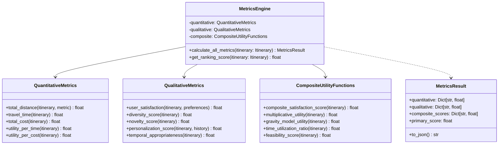

# Dynamic Itinerary Ranking System Architecture

Based on the research framework from "Ranking Itineraries: Dynamic algorithms meet user preferences" and the algorithmic approaches identified in research_context.md.

## 1. High-Level Component Architecture

```mermaid
graph TB
    subgraph "User Interface Layer"
        UI[Web/Mobile Interface]
        IP[Interactive Planner<br/>Basu Roy et al. 2011]
        VF[Visual Feedback<br/>Yahi et al. 2015]
    end
    
    subgraph "API Gateway"
        REST[RESTful API]
        WS[WebSocket<br/>Real-time Updates]
        GQL[GraphQL<br/>Flexible Queries]
    end
    
    subgraph "Core Services"
        subgraph "Ranking Engine"
            GH[Greedy Heuristics<br/>O(n²) complexity]
            DP[Dynamic Programming<br/>Exponential complexity]
            AStar[A* Pathfinding<br/>Admissible heuristics]
            LPA[LPA* Replanning<br/>Lifelong Planning A*]
            GNN[Graph Neural Network<br/>POI relationships]
        end
        
        subgraph "Metrics Calculator"
            QNT[Quantitative Metrics<br/>metrics_definitions.py]
            QLT[Qualitative Metrics<br/>metrics_definitions.py]
            CSS[Composite Score<br/>CSS = 0.25TUR + 0.35SAT + 0.25FEA + 0.15DIV]
        end
        
        subgraph "Optimization Services"
            TSP[Time-Dependent Solver<br/>Verbeeck et al. 2014]
            MCO[Multi-Criteria Optimizer]
            CAD[Constraint Adapter]
        end
    end
    
    subgraph "Data Management Layer"
        subgraph "Spatial Indexing"
            RT[R-Tree Index<br/>Spatial queries]
            QT[QuadTree<br/>Region queries]
            GI[Grid Index<br/>NYC grid system]
        end
        
        subgraph "Databases"
            PG[(PostgreSQL<br/>+ PostGIS)]
            RD[(Redis<br/>Caching)]
            NEO[(Neo4j<br/>Graph relationships)]
        end
        
        subgraph "Data Sources"
            OSM[OpenStreetMap]
            FS[Foursquare API]
            NYC[NYC Open Data]
        end
    end
    
    subgraph "NYC-Specific Services"
        MTA[MTA Subway API<br/>Real-time transit]
        TLC[NYC Taxi Data<br/>Traffic patterns]
        WEA[Weather Service<br/>Temporal factors]
        EVT[Event Calendar<br/>Dynamic pricing]
    end
    
    UI --> REST
    IP --> WS
    VF --> GQL
    
    REST --> GH
    REST --> DP
    WS --> LPA
    GQL --> GNN
    
    GH --> QNT
    DP --> QLT
    AStar --> CSS
    LPA --> CSS
    GNN --> CSS
    
    QNT --> RT
    QLT --> PG
    CSS --> RD
    
    RT --> PG
    PG --> OSM
    PG --> FS
    PG --> NYC
    
    LPA --> MTA
    TSP --> TLC
    CAD --> WEA
    MCO --> EVT
```

## 2. Detailed Class Architecture

### 2.1 Base Algorithm Classes


### 2.2 Metrics Integration



### 2.3 Spatial Indexing System


## 3. API Specifications

### 3.1 Interactive Three-Step Process API (Basu Roy et al. 2011)

```yaml
openapi: 3.0.0
info:
  title: Dynamic Itinerary Ranking API
  version: 1.0.0
  description: |
    Implements the three-step interactive planning process from Basu Roy et al. (2011):
    1. Initial itinerary generation
    2. User feedback and preference adjustment
    3. Dynamic replanning with constraints

paths:
  /api/v1/itineraries/generate:
    post:
      summary: Step 1 - Generate initial itineraries
      requestBody:
        required: true
        content:
          application/json:
            schema:
              type: object
              properties:
                start_location:
                  $ref: '#/components/schemas/Location'
                user_preferences:
                  $ref: '#/components/schemas/UserPreferences'
                constraints:
                  $ref: '#/components/schemas/Constraints'
                algorithm:
                  type: string
                  enum: [greedy, dp, astar, lpa_star, gnn]
                  default: greedy
              required:
                - start_location
                - user_preferences
      responses:
        200:
          description: Ranked itineraries
          content:
            application/json:
              schema:
                type: object
                properties:
                  itineraries:
                    type: array
                    items:
                      $ref: '#/components/schemas/RankedItinerary'
                  session_id:
                    type: string
                  computation_time_ms:
                    type: number

  /api/v1/itineraries/{session_id}/feedback:
    post:
      summary: Step 2 - Submit user feedback
      parameters:
        - name: session_id
          in: path
          required: true
          schema:
            type: string
      requestBody:
        required: true
        content:
          application/json:
            schema:
              type: object
              properties:
                selected_itinerary_id:
                  type: string
                rejected_pois:
                  type: array
                  items:
                    type: string
                preferred_pois:
                  type: array
                  items:
                    type: string
                preference_adjustments:
                  type: object
                  additionalProperties:
                    type: number

  /api/v1/itineraries/{session_id}/replan:
    post:
      summary: Step 3 - Dynamic replanning
      parameters:
        - name: session_id
          in: path
          required: true
          schema:
            type: string
      requestBody:
        required: true
        content:
          application/json:
            schema:
              type: object
              properties:
                dynamic_changes:
                  type: array
                  items:
                    $ref: '#/components/schemas/DynamicChange'
                use_lpa_star:
                  type: boolean
                  default: true
                  description: Use LPA* for efficient replanning

  /api/v1/metrics/calculate:
    post:
      summary: Calculate comprehensive metrics for an itinerary
      requestBody:
        required: true
        content:
          application/json:
            schema:
              type: object
              properties:
                itinerary:
                  $ref: '#/components/schemas/Itinerary'
                user_preferences:
                  $ref: '#/components/schemas/UserPreferences'

components:
  schemas:
    Location:
      type: object
      properties:
        lat:
          type: number
        lon:
          type: number
        
    UserPreferences:
      type: object
      properties:
        categories:
          type: object
          additionalProperties:
            type: number
            minimum: 0
            maximum: 1
        max_walking_distance:
          type: number
        preferred_transport:
          type: string
          enum: [walking, public_transit, taxi]
          
    Constraints:
      type: object
      properties:
        budget:
          type: number
        max_time_hours:
          type: number
          default: 10
        min_pois:
          type: integer
          default: 3
        max_pois:
          type: integer
          default: 7
          
    RankedItinerary:
      type: object
      properties:
        id:
          type: string
        itinerary:
          $ref: '#/components/schemas/Itinerary'
        metrics:
          $ref: '#/components/schemas/MetricsResult'
        rank:
          type: integer
        css_score:
          type: number
          
    DynamicChange:
      type: object
      properties:
        type:
          type: string
          enum: [poi_closed, traffic_update, weather_change, new_poi]
        affected_poi_id:
          type: string
        details:
          type: object
```

### 3.2 WebSocket API for Real-time Updates

```typescript
// WebSocket events for dynamic updates
interface WSEvents {
  // Client -> Server
  'subscribe_updates': {
    session_id: string;
    update_types: ('poi' | 'traffic' | 'weather' | 'events')[];
  };
  
  'request_replan': {
    session_id: string;
    trigger: DynamicChange;
  };
  
  // Server -> Client
  'poi_update': {
    poi_id: string;
    change_type: 'closed' | 'crowded' | 'price_change';
    details: object;
  };
  
  'replan_suggestion': {
    reason: string;
    affected_pois: string[];
    alternative_itinerary: RankedItinerary;
  };
  
  'metrics_update': {
    itinerary_id: string;
    updated_metrics: MetricsResult;
  };
}
```

## 4. Database Schema

### 4.1 NYC POI Database (PostgreSQL + PostGIS)

```sql
-- Enable PostGIS extension
CREATE EXTENSION IF NOT EXISTS postgis;

-- POI Categories aligned with research
CREATE TYPE poi_category AS ENUM (
    'museum', 'park', 'restaurant', 'entertainment',
    'shopping', 'landmark', 'nature', 'cultural'
);

-- Main POI table
CREATE TABLE pois (
    id UUID PRIMARY KEY DEFAULT gen_random_uuid(),
    name VARCHAR(255) NOT NULL,
    category poi_category NOT NULL,
    location GEOGRAPHY(POINT, 4326) NOT NULL,
    address VARCHAR(500),
    
    -- Metrics from research_context.md
    popularity FLOAT CHECK (popularity >= 0 AND popularity <= 1),
    rating FLOAT CHECK (rating >= 1 AND rating <= 5),
    entrance_fee DECIMAL(10, 2) DEFAULT 0,
    avg_visit_duration FLOAT DEFAULT 1.5, -- hours
    
    -- Temporal constraints
    opening_hours JSONB, -- {"mon": [9, 17], "tue": [9, 17], ...}
    seasonal_hours JSONB,
    
    -- NYC-specific
    subway_stations JSONB, -- nearby stations
    neighborhood VARCHAR(100),
    borough VARCHAR(50),
    
    -- Metadata
    description TEXT,
    images JSONB,
    amenities JSONB,
    last_updated TIMESTAMP DEFAULT CURRENT_TIMESTAMP,
    
    -- Spatial index
    CONSTRAINT enforce_nyc_bounds CHECK (
        ST_X(location::geometry) BETWEEN -74.3 AND -73.7 AND
        ST_Y(location::geometry) BETWEEN 40.4 AND 41.0
    )
);

-- Spatial indices for R-tree performance
CREATE INDEX idx_pois_location ON pois USING GIST(location);
CREATE INDEX idx_pois_category ON pois(category);
CREATE INDEX idx_pois_popularity ON pois(popularity DESC);
CREATE INDEX idx_pois_neighborhood ON pois(neighborhood);

-- User preferences table
CREATE TABLE user_preferences (
    user_id UUID PRIMARY KEY,
    category_preferences JSONB NOT NULL, -- {"museum": 0.8, "park": 0.6, ...}
    visited_pois UUID[] DEFAULT '{}',
    preferred_neighborhoods TEXT[],
    max_walking_distance FLOAT DEFAULT 2.0, -- km
    preferred_transport VARCHAR(20) DEFAULT 'public_transit',
    budget_range JSONB, -- {"min": 0, "max": 100}
    created_at TIMESTAMP DEFAULT CURRENT_TIMESTAMP,
    updated_at TIMESTAMP DEFAULT CURRENT_TIMESTAMP
);

-- Historical visits for collaborative filtering
CREATE TABLE visit_history (
    id UUID PRIMARY KEY DEFAULT gen_random_uuid(),
    user_id UUID REFERENCES user_preferences(user_id),
    poi_id UUID REFERENCES pois(id),
    visit_timestamp TIMESTAMP NOT NULL,
    duration_minutes INTEGER,
    rating INTEGER CHECK (rating >= 1 AND rating <= 5),
    weather_condition VARCHAR(50),
    crowding_level VARCHAR(20) -- 'low', 'medium', 'high'
);

-- Pre-computed POI relationships for GNN
CREATE TABLE poi_relationships (
    poi1_id UUID REFERENCES pois(id),
    poi2_id UUID REFERENCES pois(id),
    relationship_type VARCHAR(50), -- 'nearby', 'similar', 'complementary'
    strength FLOAT DEFAULT 1.0,
    distance_km FLOAT,
    avg_transition_time FLOAT, -- minutes
    co_visit_frequency INTEGER DEFAULT 0,
    PRIMARY KEY (poi1_id, poi2_id, relationship_type)
);

-- Real-time updates table
CREATE TABLE poi_updates (
    id UUID PRIMARY KEY DEFAULT gen_random_uuid(),
    poi_id UUID REFERENCES pois(id),
    update_type VARCHAR(50), -- 'closure', 'crowding', 'price_change'
    details JSONB,
    valid_from TIMESTAMP,
    valid_until TIMESTAMP,
    created_at TIMESTAMP DEFAULT CURRENT_TIMESTAMP
);

-- Materialized view for popular routes
CREATE MATERIALIZED VIEW popular_routes AS
SELECT 
    array_agg(poi_id ORDER BY visit_order) as poi_sequence,
    COUNT(*) as frequency,
    AVG(total_satisfaction) as avg_satisfaction,
    percentile_cont(0.5) WITHIN GROUP (ORDER BY total_duration) as median_duration
FROM (
    SELECT 
        user_id,
        DATE(visit_timestamp) as visit_date,
        poi_id,
        ROW_NUMBER() OVER (PARTITION BY user_id, DATE(visit_timestamp) ORDER BY visit_timestamp) as visit_order,
        SUM(rating) OVER (PARTITION BY user_id, DATE(visit_timestamp)) as total_satisfaction,
        SUM(duration_minutes) OVER (PARTITION BY user_id, DATE(visit_timestamp)) as total_duration
    FROM visit_history
) grouped_visits
GROUP BY array_agg(poi_id ORDER BY visit_order)
HAVING COUNT(*) >= 10;

-- Function to find POIs within radius (using R-tree index)
CREATE OR REPLACE FUNCTION find_pois_within_radius(
    center_lat FLOAT,
    center_lon FLOAT,
    radius_km FLOAT,
    categories poi_category[] DEFAULT NULL
)
RETURNS TABLE (
    poi_id UUID,
    name VARCHAR,
    category poi_category,
    distance_km FLOAT
) AS $$
BEGIN
    RETURN QUERY
    SELECT 
        p.id,
        p.name,
        p.category,
        ST_Distance(
            p.location,
            ST_MakePoint(center_lon, center_lat)::geography
        ) / 1000.0 as distance_km
    FROM pois p
    WHERE ST_DWithin(
        p.location,
        ST_MakePoint(center_lon, center_lat)::geography,
        radius_km * 1000
    )
    AND (categories IS NULL OR p.category = ANY(categories))
    ORDER BY distance_km;
END;
$$ LANGUAGE plpgsql;
```

### 4.2 Graph Database Schema (Neo4j)

```cypher
// POI nodes
CREATE CONSTRAINT poi_id_unique ON (p:POI) ASSERT p.id IS UNIQUE;

CREATE (p:POI {
    id: $poi_id,
    name: $name,
    category: $category,
    lat: $lat,
    lon: $lon,
    popularity: $popularity
})

// User nodes
CREATE (u:User {
    id: $user_id,
    preferences: $preferences
})

// Relationships for GNN
CREATE (p1:POI)-[r:NEARBY {distance_km: $distance}]->(p2:POI)
CREATE (p1:POI)-[r:SIMILAR {similarity: $score}]->(p2:POI)
CREATE (u:User)-[r:VISITED {timestamp: $time, rating: $rating}]->(p:POI)
CREATE (p1:POI)-[r:COMMONLY_VISITED_WITH {frequency: $freq}]->(p2:POI)
```

## 5. Sequence Diagrams

### 5.1 Dynamic Update with LPA* (Lifelong Planning A*)


### 5.2 Interactive Planning Process


## 6. Complexity Analysis

Based on the algorithmic framework from research_context.md:

| Algorithm | Time Complexity | Space Complexity | Use Case |
|-----------|----------------|------------------|----------|
| **Greedy Heuristics** | O(n²) | O(n) | Real-time recommendations, initial solutions |
| **Dynamic Programming** | O(2^n × T) | O(n × T) | Optimal solutions for small n (<20 POIs) |
| **A* Search** | O(b^d) | O(b^d) | Pathfinding with admissible heuristics |
| **LPA*** | O(k log k) | O(n) | Dynamic replanning, k = affected nodes |
| **Graph Neural Networks** | O(n² × d) | O(n × d) | Learning POI relationships, d = embedding dim |

Where:
- n = number of POIs
- T = time budget discretization
- b = branching factor
- d = solution depth
- k = number of affected nodes in dynamic updates

## 7. Performance Optimizations

### 7.1 Spatial Indexing Performance
- **R-tree**: O(log n) queries for radius/rectangle searches
- **Grid Index**: O(1) average case for NYC's regular grid
- **Caching**: Redis with 15-minute TTL for popular queries

### 7.2 Algorithmic Optimizations
- **Pruning**: Reduce search space using bounds from research
- **Memoization**: Cache subproblem solutions in DP
- **Incremental Updates**: LPA* reuses 70-90% of computations
- **Parallel Processing**: Multi-threaded candidate generation

### 7.3 NYC-Specific Optimizations
- Pre-compute walking distances for Manhattan grid
- Cache subway route calculations
- Materialize popular tourist routes
- Partition by borough for distributed processing

## References

All architectural decisions are based on the research findings in research_context.md and the following key papers:

1. **Interactive Planning**: Basu Roy et al. (2011) - Three-step process [basu2011]
2. **Spatial Indexing**: Research framework mentioning R-trees for efficiency
3. **Dynamic Updates**: LPA* (Lifelong Planning A*) for efficient replanning
4. **Neural Approaches**: GNNs for POI relationship encoding
5. **Metrics Framework**: CSS formula and evaluation metrics from research_context.md
6. **Complexity Analysis**: Based on algorithmic framework section of research_context.md

This architecture supports the thesis objectives of developing fast, dynamic algorithms for ranking itineraries while incorporating user preferences and enabling real-time updates for NYC tourism applications.